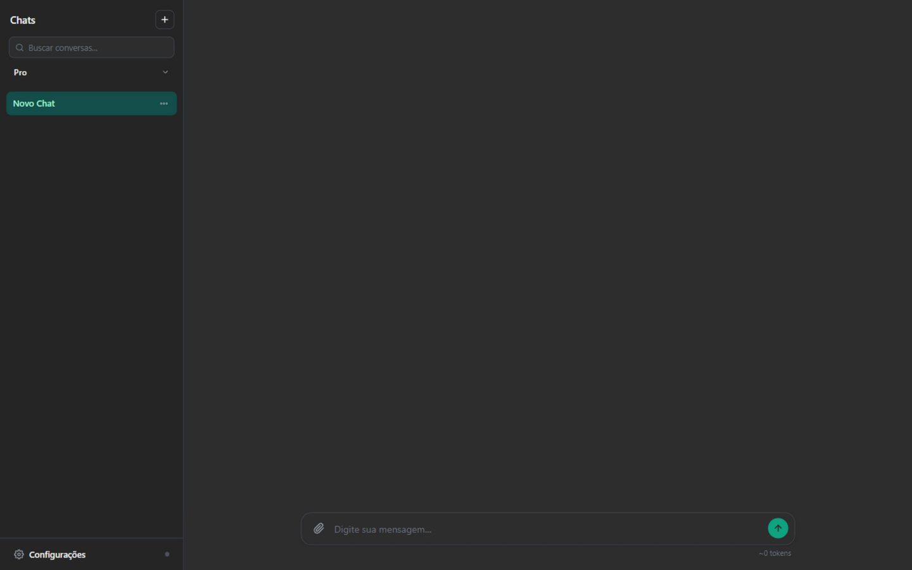

# DarkForest

Chatbot web minimalista, sem build e sem instalação, com roteamento inteligente de modelos via Jev e RAG vetorial para documentos.

Abra o `darkforest.html`, configure sua chave e use.



OpenAI · Jev · RAG · Gemini Embeddings · HTML/CSS/JS

   

## Sobre

O DarkForest é um chatbot local-first que combina:

- modelos GPT da OpenAI
- roteamento adaptativo via Jev
- RAG vetorial para PDFs
- armazenamento local no navegador
- interface em português

## Recursos

### Roteamento inteligente

O Jev escolhe o modelo e o esforço de raciocínio conforme a solicitação, dentro do modo selecionado (Pro ou Lite).

### RAG vetorial

PDFs são fragmentados, indexados localmente e recuperados por similaridade semântica — apenas os trechos relevantes entram no prompt.

### Auto Eco

Proteção de entrada, avaliação de saída e organização automática das conversas.

### Local-first

Chaves e dados de uso permanecem no navegador sempre que possível.

## Início rápido

```text
1. Baixe darkforest.html
2. Abra no navegador
3. Informe sua chave OpenAI
4. Comece a conversar
```

### RAG

Adicione sua chave Gemini nas configurações.

### Jev (BYOK — opcional)

Cada usuário usa a **própria chave**, informada nas Configurações (ou `window.JEV_API_KEY` / `localStorage.jev_api_key`). O navegador fala direto com o provedor — sem backend:

- **Vercel AI Gateway** (`vck_...`/`vck-...`) — chama `/v4/ai/evaluation-model` com o modelo `typesafe-ai/jev` (CORS aberto, funciona de qualquer página).
- **TypeSafe AI** (API original) — chama `https://api.typesafe.ai/v1/systemone` com o modelo `jev-latest`. Atenção: a API da TypeSafe mantém uma allowlist de origens (CORS) e hoje bloqueia chamadas vindas do navegador de terceiros — se a chamada falhar, o app cai automaticamente na heurística local.

O provedor é detectado automaticamente pelo prefixo da chave. Sem chave, o Auto Eco funciona só com heurísticas locais.

## Modos Pro e Lite

| Modo | Perfil |
|------|--------|
| **Pro** | Maior capacidade e raciocínio adaptativo |
| **Lite** | Menor custo e respostas mais rápidas |

> O Jev escolhe dinamicamente o modelo e o esforço de raciocínio dentro de cada modo.

### Roteamento interno

| Modo | Modelos candidatos | Esforço de raciocínio |
|------|--------------------|------------------------|
| **Pro** | `gpt-5.4` ou `gpt-5.4-mini`, escolhidos pelo Jev conforme complexidade, anexos e tipo de pedido | Definido pelo Jev (`low`, `medium` ou `high`) para qualquer modelo |
| **Lite** | `gpt-5.4-mini` ou `gpt-4.1-mini`, escolhidos pelo Jev; solicitações simples são atendidas pelo `gpt-4.1-mini` | O `gpt-5.4-mini` recebe esforço definido pelo Jev (`low`, `medium` ou `high`), com criação de código fixada em `high`; o `gpt-4.1-mini` responde sem raciocínio |

Regras determinísticas no código complementam a decisão do Jev: no modo **Pro**, anexos, PDFs e solicitações complexas são direcionados ao `gpt-5.4` (via Responses API); no modo **Lite**, a criação de código é direcionada ao `gpt-5.4-mini` com esforço `high`. O modelo e o esforço efetivamente utilizados são exibidos junto a cada resposta.

## RAG

Na ausência de chave de embeddings, o chat opera em modo clássico: o documento é incluído integralmente no prompt, com controle de tamanho.

Com uma chave válida (Gemini ou NVIDIA), o modo vetorial é ativado automaticamente:

1. O PDF anexado é dividido em trechos (chunks).
2. Cada trecho é convertido em embedding — `gemini-embedding-2` (1536 dimensões) ou `nvidia/nemotron-3-embed-1b` (512 dimensões) — com fila com limite de RPM/TPM.
3. Os embeddings são armazenados em cache no IndexedDB, junto às conversas.
4. A cada pergunta, a busca por similaridade de cosseno seleciona os 20 trechos mais próximos.
5. O Jev reordena os candidatos e apenas os 5 trechos que respondem à pergunta entram no prompt.

## Auto Eco

O Auto Eco é a camada de avaliação e proteção do chat, construída sobre o Jev (com fallback em heurísticas locais):

- **Antes do envio**: detecção de tentativas de jailbreak (bloqueia antes de consumir a API, com opção de envio manual) e alerta de dados pessoais sensíveis (CPF, cartão de crédito, senhas).
- **Depois da resposta**: avaliação de qualidade, recusa indevida, código quebrado e aderência às fontes recuperadas (groundedness).
- **Organização**: classificação de importância e conclusão de tarefa alimentam o auto-pin e a busca por tags.

## Configuração

### Obrigatório

- **OpenAI** (`sk-...`) — conversação. Informe na interface (colagem direta ou importação de arquivo `.env`) ou crie um arquivo `chatgpt.js` junto ao HTML com `const OPENAI_API_KEY = "sk-...";`.

### Opcional

- **Gemini** (`AIza...` ou `AQ....`) — embeddings do RAG (`gemini-embedding-2`). Informe no campo de chave de embeddings, nas Configurações.
- **NVIDIA** (`nvapi-...`) — provedor alternativo de embeddings (`nemotron-3-embed-1b`). Mesmo campo; o formato da chave determina o provedor.
- **Jev** (`vck_...` do Vercel AI Gateway ou chave da TypeSafe AI) — roteamento Pro/Lite e rerank do RAG. Informe no campo "Jev" nas Configurações; a chamada vai direto do navegador ao provedor.

## Arquitetura

```text
Usuário
   ↓
DarkForest
   ↓
Jev
   ↓
Seleção de modelo + esforço
   ↓
OpenAI
   ↓
Resposta
```

Com RAG:

```text
PDF
 ↓
Extração
 ↓
Chunking
 ↓
Embeddings
 ↓
IndexedDB
 ↓
Busca top-20
 ↓
Jev rerank
 ↓
Top-5
 ↓
Modelo
```

## Estrutura do projeto

```
darkforest.html   # Aplicação completa (HTML + CSS + JS), incluindo a camada Jev BYOK
.env              # Chaves de API (local, não versionado)
.gitignore        # Ignora segredos (.env, chaves, chatgpt.js)
```

## Segurança

- As chaves da OpenAI e dos embeddings são utilizadas apenas pelo navegador, enviadas exclusivamente para os provedores correspondentes.
- A chave do Jev fica apenas no `localStorage` do usuário e sai do navegador somente para o provedor escolhido (Vercel AI Gateway ou TypeSafe AI).
- Arquivos `.env`, `chatgpt.js`, `chave_api.js` e `*.key` são ignorados pelo Git e não devem ser commitados.
- Em hospedagens públicas (por exemplo, GitHub Pages), cada usuário deve fornecer suas próprias credenciais.

## Stack

- HTML5 / CSS3 / JavaScript
- OpenAI API (Responses API e Chat Completions)
- Jev BYOK direto do navegador (Vercel AI Gateway ou API TypeSafe AI)
- Gemini Embeddings
- PDF.js
- highlight.js
- IndexedDB

## Licença

Distribuído sob a licença MIT. Consulte o arquivo [LICENSE](LICENSE).
